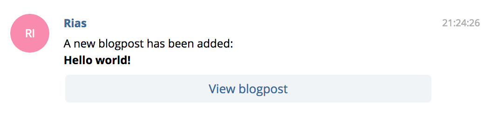

[](https://github.com/riasvdv/craft-telegram-notification-channel/releases)
[](https://scrutinizer-ci.com/g/riasvdv/craft-telegram-notification-channel)
[](https://styleci.io/repos/118666814)
[](https://packagist.org/packages/rias/craft-telegram-notification-channel)

# Telegram Notification Channel plugin for Craft Notifications

A Telegram notification channel for the [Craft Notifications](https://github.com/riasvdv/craft-notifications) plugin

## Support Open Source. Buy beer.

This plugin is licensed under a MIT license, which means that it's completely free open source software, and you can use it for whatever and however you wish. If you're using it and want to support the development, buy me a beer over at Beerpay!

[](https://beerpay.io/Rias500/craft-telegram-notification-channel)

## Requirements

- Make sure you have [Craft Notifications](https://github.com/riasvdv/craft-notifications) installed

## Installation

To install the plugin, follow these instructions.

1. Open your terminal and go to your Craft project:

        cd /path/to/project

2. Then tell Composer to load the plugin:

        composer require rias/craft-telegram-notification-channel

3. In the Control Panel, go to Settings → Plugins and click the “Install” button for Telegram Notification Channel.

## Setting up your Telegram Bot

Talk to [@BotFather](https://core.telegram.org/bots#6-botfather) and generate a Bot API Token.

Then, configure your Telegram Bot API Token either through the plugin settings or by copying the `config.php` file to `config/telegram-notification-channel.php` and setting the `token` there.

## Using the Telegram Notification Channel
You can now add `telegram` to your `via()` function. You will also have to provide a `toTelegram` function to create your message.

```php
use rias\notifications\models\Notification;
use rias\telegramnotificationchannel\models\TelegramMessage;

/**
 * Get the notification's delivery channels.
 *
 * @return array
 */
public function via()
{
    return ['telegram' => '<YOUR_USER_ID/CHAT_ID>'];
}

public function toTelegram()
{
    $blogpost = $this->event->sender;

    return TelegramMessage::create()
        //->to($this->user->telegram_user_id) // You can provide a different user or chat to send to here.
        ->content("A new blogpost has been added:\n*{$blogpost->title}*") // Markdown supported.
        ->button('View blogpost', $blogpost->url); // Inline Button
}
```

Here's a screenshot preview of the above notification on Telegram Messenger:



### Available message methods

- `to($chatId)`: (integer) Recipient's chat id or user id.
- `content('')`: (string) Notification message, supports markdown. For more information on supported markdown styles, check out these docs.
- `button($text, $url)`: (string) Adds an inline "Call to Action" button. You can add as many as you want and they'll be placed 2 in a row.
- `options([])`: (array) Allows you to add additional or override sendMessage payload (A Telegram Bot API method used to send message internally). For more information on supported parameters, check out these docs.

## Credits
- [Laravel Notifications Channel - Telegram](https://github.com/laravel-notification-channels/telegram)

Brought to you by [Rias](https://rias.be)
